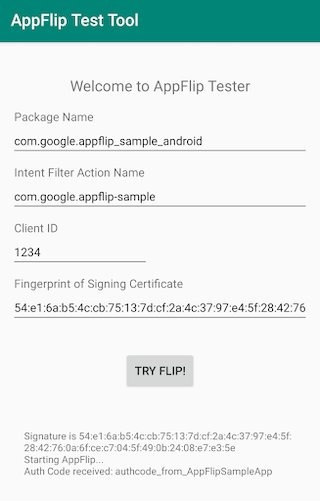

# App Flip Test Tool for Android

[![ci][1]][2]

The App Flip Test Tool is designed to verify your Android app's integration with
App Flip for Google account linking.
This app simulates the intent triggered by Google mobile apps when App Flip is enabled.
Use this tool to debug issues you may be experiencing with App Flip and account linking
in your Android app.

The App Flip Test Tool can be used to test with the Google
[App Flip Sample for Android](https://github.com/googlesamples/identity-appflip-android),
or your own Android app with an App Flip account linking integration.

Documentation links:

- [App Flip Overview](https://developers.google.com/identity/account-linking/app-flip-overview)
- [App Flip for Android](https://developers.google.com/identity/account-linking/app-flip-android)

## Prerequisites

1. Android Studio installed (version 3.0 or above)
1. Android device or emulator (API 26 or above) with your target app installed

## Getting started

1. Import the project into Android Studio
1. Open `res/values/strings.xml` and edit the following values:
   - `package_id`: Application id of your app
   - `intent_filter_name`: Intent action configured with App Flip for your app
   - `target_app_signature`: SHA256 fingerprint for your app's signature
     ([how do I find this?](https://developers.google.com/android/guides/client-auth))
   - `client_id`: Client id configured with App Flip for your app
   - `scope`: Optional additional auth scopes configured with App Flip for your app
1. Build and run the app on your target device

## Usage

Launch the test tool application on your device, and tap **Try Flip**.
The device should launch your Android app to complete the authorization flow.
After completing user authorization, the test tool will display any `auth_code`
or `error` messages in the log.

## Screenshots

## License

Copyright 2019 Google LLC

Licensed under the Apache License, Version 2.0 (the "License");
you may not use this file except in compliance with the License.
You may obtain a copy of the License at

    http://www.apache.org/licenses/LICENSE-2.0

Unless required by applicable law or agreed to in writing, software
distributed under the License is distributed on an "AS IS" BASIS,
WITHOUT WARRANTIES OR CONDITIONS OF ANY KIND, either express or implied.
See the License for the specific language governing permissions and
limitations under the License.

[1]: https://github.com/googlesamples/identity-appflip-tester-android/workflows/ci/badge.svg
[2]: https://github.com/googlesamples/identity-appflip-tester-android/actions
